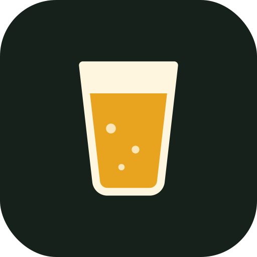

<div align="center">



# Beers

**Dein persönliches Bier-Tagebuch. Bewerten, sammeln, Erfolge freischalten.**
Offline, ohne Konto, ohne Werbung. Deine Daten bleiben auf deinem Handy.


[Installation](#-installation) · [Funktionen](#-funktionen) · [Wissenswertes](#-wissenswertes) · [Bibliotheken](#-enthaltene-bibliotheken) · [Credits](#-credits)

</div>

---

## 🍺 Worum geht es?

Beers ist eine installierbare Web-App (PWA) zum Erfassen und Bewerten von Bieren. Sie ist der Nachfolger der Android-App **«Beers» von Mariusz Hopa**, die nicht mehr im Google Play Store erhältlich ist. Alle Funktionen der Vorlage sind übernommen, dazu kommen Barcode-Scan, lokale Etikett-Erkennung, Geschmacksprofile, Weltkarte und über 80 Erfolge.

Bestehende Sammlungen aus der Original-App lassen sich samt Fotos importieren.

---

## 📲 Installation

### 1 · Auf dem Handy installieren

| Android (Chrome) | iPhone (Safari) |
|---|---|
| Adresse öffnen → Menü **⋮** → **App installieren** | Adresse öffnen → **Teilen** → **Zum Home-Bildschirm** |

Danach startet Beers wie eine normale App, mit eigenem Icon, im Vollbild und auch offline.

### 2 · Bestehende Daten übernehmen

<details>
<summary><b>Aus der Original-App «Beers» (Android)</b></summary>

1. In der Original-App: **Settings → Backup data**. Es entsteht eine XML-Datei, z. B. `Beers_Week_2026_40.xml`.
2. In Beers: **Einstellungen → Alte Beers-App → Backup (XML) importieren**
3. Danach **Fotos zuordnen** und im Dateimanager alle Bilder `BEER_JJJJMMTThhmmss.jpg` auswählen.

> [!TIP]
> Fotos über den **Dateimanager** auswählen, nicht über die Galerie. Die Galerie-Auswahl von Android benennt Dateien um, dann klappt die Zuordnung über den Dateinamen nicht. Als Rückfallebene ordnet die App auch über den Speicherzeitpunkt zu (±3 Minuten).

</details>

---

## ✨ Funktionen

### 📚 Sammlung
- Raster- oder Listenansicht, umschaltbar
- Suche nach Name, Brauerei, Stil, Ort, Land, Notiz und Barcode
- Sortierung nach Datum, Bewertung oder Name
- Detailansicht mit Fotogalerie, Fakten und weiteren Bieren derselben Brauerei
- «Nochmals getrunken» zählt wiederholte Biere hoch

### ✍️ Erfassen
- Bis zu **4 Fotos** pro Bier, automatisch auf 1280 px komprimiert
- Bewertung in **halben Sternen** (0.5–5)
- Auswahllisten mit Suche für **Stil, Brauerei, Land und «Getrunken in»**. Neue Einträge lassen sich direkt anlegen und erscheinen danach in der Liste.
- Brauerei gewählt → Land wird automatisch vorgeschlagen
- **Farbe** in 6 Stufen mit Farbmuster (EBC/SRM)
- **Geschmacksprofil** (optional): Herb, Hopfig, Malzig, Süss, Fruchtig, Sauer, Vollmundig, Spritzig. In der Detailansicht als Netzdiagramm.
- Weitere Angaben: Alkohol, IBU, Stammwürze, Grösse, Preis, Währung, Anzahl, Notizen
- Duplikat-Warnung bei gleichem Namen oder Barcode

### 📷 Etikett & Barcode
- **Barcode-Scan** (EAN/UPC) direkt auf dem Gerät. Zeigt sofort, ob du das Bier schon getrunken hast oder auf der Merkliste führst.
- Registrierungsland aus dem GS1-Präfix (z. B. 520 = Griechenland, 76 = Schweiz)
- **Lokale Texterkennung**: Alkohol, Füllmenge, IBU sowie bekannte Brauereien, Stile und Länder werden automatisch erkannt. Weitere Wörter erscheinen als antippbare Auswahl und lassen sich ins Feld übernehmen.

### 🔖 Merkliste
Biere zum Probieren vormerken, z. B. im Laden oder in der Bar. Mit **«Getrunken»** wird der Eintrag samt Foto in die Sammlung übernommen.

### 📊 Statistik
- Kennzahlen: Biere, Länder, Stile, Brauereien, Ø Bewertung
- **Weltkarte**, eingefärbt nach Anzahl Biere, mit Zoom auf jeden Kontinent. Antippen zeigt Details und filtert die Sammlung.
- **Top-5-Säulendiagramm** für Stilfamilien, Stile, Brauereien, Orte, Jahre und Bewertungen
- Ranglisten mit Anzahl und Ø Bewertung, antippen filtert die Sammlung

### 🏆 Erfolge
**88 Erfolge** mit zusammen **19 717 Punkten**. Jeder Erfolg lässt sich antippen und zeigt den Fortschritt.

| Kategorie | Anzahl | Beispiele |
|---|:-:|---|
| Biere | 8 | Erstes Bier, 100 Biere, Schnapszahl (333), 1000 Biere |
| Länder | 5 | 10 bis 150 Länder |
| Kontinente | 7 | Erstes Bier pro Kontinent, Die ganze Welt |
| Kontinent komplett | 6 | Alle Staaten eines Kontinents, mit Liste der fehlenden Länder |
| Stile | 8 | 5 bis 100 verschiedene Stile |
| Brauereien | 11 | 10 bis 500 Brauereien |
| Stilfamilien | 11 | Je 25 Biere einer Familie: Hopfenkopf, Dunkle Seite, Mönchsfreund … |
| Treue | 9 | 1 Monat bis 10 Jahre Bier-Tagebuch |
| Spass | 23 | Feuchtfröhlich, Inselhüpfer, Bier-ABC, Regenbogen, Freitag, der 13. … |

### 💾 Backup
- **Backup mit Fotos** als ZIP-Datei, direkt teilbar an Google Drive, Mail usw.
- Import von ZIP, JSON und XML (Original-App)
- Erinnerung, wenn das letzte Backup älter als 30 Tage ist

### 🎨 Darstellung
Hell, Dunkel oder wie das System. Jede Stilfamilie hat ein eigenes Icon mit passender Glasform und Bierfarbe:

| Familie | Glas | Familie | Glas |
|---|---|---|---|
| Lager & Helles | Krug | Pils | Pilsstange |
| Pale Ale & Blonde | Nonic-Pint | IPA | Tulpe |
| Amber & Red | Nonic-Pint | Dunkel & Bock | Krug |
| Stout & Porter | Nonic-Pint | Weizen & Wit | Weizenglas |
| Belgisch & Abtei | Kelch | Sour & Frucht | Schale |
| Alkoholfrei & Radler | Dose | | |

---

## 💡 Wissenswertes

> [!WARNING]
> **Deine Daten liegen nur auf diesem Gerät.** Wer die Browserdaten von Chrome löscht oder die App deinstalliert, löscht auch die Sammlung. Erstelle deshalb regelmässig ein **Backup mit Fotos** und lege es in Google Drive oder an einem anderen sicheren Ort ab.

**🔒 Datenschutz**
Kein Konto, kein Server, keine Werbung, kein Tracking. Fotos, Bewertungen und Notizen verlassen das Gerät nur, wenn du selbst ein Backup teilst.

**📶 Offline**
Nach dem ersten Öffnen funktioniert die App ohne Internet. Die Texterkennung lädt ihre Sprachdaten (ca. 6 MB) beim ersten Scan und speichert sie danach lokal.

**🔍 Grenzen der Texterkennung**
Die Erkennung läuft vollständig auf dem Gerät und ist kostenlos. Klare Schrift auf Rückseiten (Alkohol, Füllmenge, Brauerei) wird gut gelesen, Designschriften und Logos auf gewölbten Flaschen oft nicht. Tipp: Vorder- und Rückseite fotografieren, gerade und gut beleuchtet.

**🏷️ Barcode und Herkunft**
Das Barcode-Präfix zeigt, in welchem Land der Code registriert wurde. Das ist meist, aber nicht immer das Brauereiland. Name oder Alkoholgehalt stehen nicht im Barcode.

**🌍 Weltkarte**
England, Schottland, Wales und Nordirland werden einzeln erfasst, auf der Karte aber als Grossbritannien dargestellt. Für «Kontinent komplett» zählen die UN-Mitgliedstaaten plus Vatikan. Gebiete wie Aruba oder Curaçao zählen für den ersten Erfolg pro Kontinent, aber nicht für «komplett».

**🔄 Updates**
Geänderte Dateien im Repository ersetzen. Die App lädt die neue Version beim nächsten Öffnen mit Internet. Bei Änderungen an `sw.js` die Konstante `VERSION` erhöhen.

**📱 Browser**
Am besten in Chrome auf Android. Auf dem iPhone funktioniert die App in Safari; der Barcode-Scan nutzt dort die mitgelieferte ZXing-Bibliothek.

---

## 🗂️ Projektstruktur

```
beers/
├── index.html              App (HTML, CSS, JavaScript in einer Datei)
├── manifest.webmanifest    PWA-Beschreibung (Name, Icons, Farben)
├── sw.js                   Service Worker für den Offline-Betrieb
├── .nojekyll               verhindert die Jekyll-Verarbeitung auf GitHub Pages
├── icons/                  App-Icons (192, 512, maskable)
└── vendor/
    ├── jszip.min.js        ZIP-Backup
    ├── zxing.min.js        Barcode-Erkennung
    ├── tesseract/          Texterkennung (Engine + WebAssembly)
    └── lang/               Sprachdaten Englisch und Deutsch
```

---

## 📦 Enthaltene Bibliotheken

| Bibliothek | Version | Zweck | Lizenz |
|---|:-:|---|---|
| [Tesseract.js](https://github.com/naptha/tesseract.js) | 5.1.1 | Lokale Texterkennung (OCR) | Apache-2.0 |
| [tesseract.js-core](https://github.com/naptha/tesseract.js-core) | 5.1.1 | Tesseract-Engine als WebAssembly | Apache-2.0 |
| [tessdata_fast](https://github.com/tesseract-ocr/tessdata_fast) | eng, deu | Sprachdaten für die Texterkennung | Apache-2.0 |
| [ZXing (JavaScript)](https://github.com/zxing-js/library) | 0.21.3 | Barcode-Erkennung (EAN/UPC) | Apache-2.0 |
| [JSZip](https://github.com/Stuk/jszip) | 3.10.1 | Backup als ZIP-Datei | MIT / GPLv3 |
| [world-atlas](https://github.com/topojson/world-atlas) / [Natural Earth](https://www.naturalearthdata.com) | 2.0.2 | Ländergrenzen der Weltkarte | ISC / Public Domain |
| [i18n-iso-countries](https://github.com/michaelwittig/node-i18n-iso-countries) | 7.14.0 | Zuordnung der Länder-Codes (beim Erstellen der Karte) | MIT |
| [Bricolage Grotesque](https://fonts.google.com/specimen/Bricolage+Grotesque) | – | Schriftart (über Google Fonts) | SIL OFL 1.1 |

---

## 🙏 Credits

<table>
<tr>
<td width="96" align="center">🍻</td>
<td>

**Vorlage: «Beers» von [Mariusz Hopa](https://play.google.com/store/apps/details?id=pl.hoper.mariusz.beerlibrary)**

Die Idee, der Funktionsumfang und das Erfolgssystem dieser App gehen auf die Android-App **Beers** (Paket `pl.hoper.mariusz.beerlibrary`) von Mariusz Hopa zurück. Laut [Softonic](https://beers.de.softonic.com/android) wurde sie zuletzt am 8. Juni 2023 aktualisiert (Version 1.3.3).

Danke für viele Jahre treue Begleitung beim Biertrinken!

</td>
</tr>
</table>

Dieses Projekt ist eine **unabhängige Neuentwicklung** für den privaten Gebrauch. Es enthält keinen Programmcode der Original-App und steht in keiner Verbindung zu Mariusz Hopa. Das Backup-Format der Original-App wird nur gelesen, damit bestehende Sammlungen übernommen werden können.

Entwickelt von Elias Schatzmann mit Unterstützung von Claude (Anthropic).

---

<div align="center">

**Prost!** 🍺

</div>
